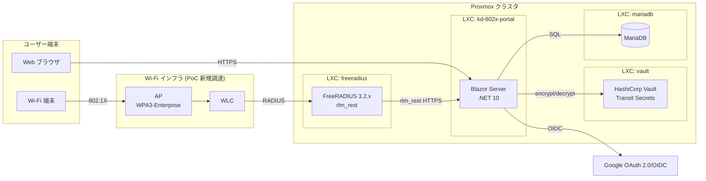
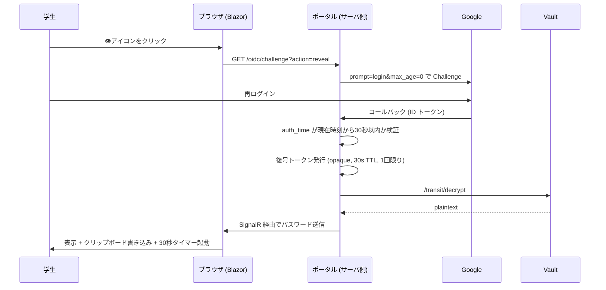

# kd-802x-portal アーキテクチャ設計書

## 1. システム概要

### 1.1 目的

神戸電子専門学校の学生向けに、学内 802.1x (WPA3-Enterprise) 認証用の ID/パスワードを学生自身が発行・管理できる Web ポータルを提供する。**2 ヶ月の PoC** を通じて、運用ポリシーと本番設計の評価材料を得る。

### 1.2 姉妹プロジェクトとの関係

`../eduroam-docker` は同じ運営法人 (学校法人コンピュータ総合学園) で進行中の eduroam IdP/SP プロジェクト。本ポータルは独立した「学内 SSID 用 ID 発行ポータル」だが、以下を eduroam-docker と統一する:

- **EAP 方式**: EAP-TTLS/PAP (端末プロファイルの二重化を回避)
- **インフラ基盤**: Proxmox VE クラスタ上の LXC/VM
- **設計思想**: 外部 Identity 匿名化、`auth_goodpass=no`/`auth_badpass=no`、サーバ証明書による相互認証

### 1.3 PoC スコープ

| 含む | 含まない (本番検討事項) |
|---|---|
| Google SSO ログイン (`@st.kobedenshi.co.jp` 制限) | 監査ログ (表示・再生成イベント) |
| パスワード生成・Vault 暗号化保管 | EAP-TLS 移行 |
| パスワード復号表示 (再認証必須) | 卒業時アカウント無効化 |
| 30 秒自動非表示・クリップボード自動クリア | Vault HA・TLS 公開 CA 化 |
| EAP-TTLS/PAP で WPA3-Enterprise SSID 認証 | Windows プロファイルのセルフサービス配布 |
| iOS / macOS / Android / Windows 11 の互換性検証 | 多言語対応 |

## 2. アーキテクチャ概要

### 2.1 構成要素



### 2.2 主要データフロー

#### A. アカウント作成 (初回ログイン)

1. 学生がポータル URL にアクセス → Google SSO に転送
2. Google で `@st.kobedenshi.co.jp` 認証成功 → ポータルへリダイレクト
3. ポータルが ID トークンの `hd` クレーム + `email_verified=true` を検証
4. メールローカル部 (学籍番号) を取り出し、`users` テーブルに INSERT (存在しなければ)
5. 16 バイトの安全乱数からパスワードを生成 (Base64URL 由来の 22 文字 ASCII printable)
6. Vault Transit `/transit/encrypt` で暗号化 → `encrypted_passwords` テーブルに保存
7. ダッシュボードを表示 (パスワードは `****` マスク)

#### B. パスワード表示 (再認証)



#### C. 802.1x 認証

1. 端末が WPA3-Enterprise SSID に接続 → AP/WLC が EAP-Start
2. WLC が FreeRADIUS に Access-Request (Outer Identity: `anonymous@st.kobedenshi.co.jp`)
3. EAP-TTLS で TLS トンネル確立 (FreeRADIUS の自己署名サーバ証明書)
4. トンネル内 PAP: 端末が `<学籍番号>@st.kobedenshi.co.jp` + 平文パスワードを送信
5. FreeRADIUS が `rlm_rest` で **ポータルの認証 API** を HTTPS POST 呼び出し
6. ポータルが `users` を引いて `encrypted_passwords` を Vault で復号、タイミング安全な比較
7. ポータルが `{ "result": "accept" }` または `{ "result": "reject" }` を返却
8. FreeRADIUS が Access-Accept / Reject を WLC に返却 → EAP-Success / Failure

## 3. データモデル

### 3.1 ポータル独自スキーマ

FreeRADIUS の標準スキーマ (`radcheck` 等) は使わない。`rlm_rest` で外部委譲するため、ポータルが自然なスキーマを持つ。

```sql
CREATE TABLE users (
    id            BIGINT UNSIGNED AUTO_INCREMENT PRIMARY KEY,
    username      VARCHAR(64)     NOT NULL UNIQUE,  -- 学籍番号 (Google email local part)
    email         VARCHAR(255)    NOT NULL UNIQUE,
    created_at    DATETIME(6)     NOT NULL,
    updated_at    DATETIME(6)     NOT NULL
) ENGINE=InnoDB CHARSET=utf8mb4;

CREATE TABLE encrypted_passwords (
    id              BIGINT UNSIGNED AUTO_INCREMENT PRIMARY KEY,
    user_id         BIGINT UNSIGNED NOT NULL UNIQUE,
    ciphertext      TEXT            NOT NULL,        -- vault:v1:... 形式 (鍵バージョンは ciphertext に埋め込まれている)
    created_at      DATETIME(6)     NOT NULL,
    updated_at      DATETIME(6)     NOT NULL,
    FOREIGN KEY (user_id) REFERENCES users(id) ON DELETE CASCADE
) ENGINE=InnoDB CHARSET=utf8mb4;
```

- パスワード本体のインデックスは不要 (ユーザー単位で 1 つだけ)
- 再生成時は同一行を UPDATE (履歴は持たない、PoC スコープ外)
- `username` / `email` は **INSERT 前に lowercase + ドット除去で正規化** する。Google はローカル部のドットを無視する仕様 (例: `john.doe@` と `johndoe@` は同一アカウント) のため、防御的に実装。学籍番号運用では実害は薄いが、整合性のため徹底

### 3.2 OR マッパー方針

- **EF Core 10** + `Pomelo.EntityFrameworkCore.MySql` (MariaDB 公式互換)
- マイグレーションは `dotnet ef migrations` で IaC 化
- FreeRADIUS は同じ DB に**接続しない** (rlm_rest で完全分離)。スキーマ衝突を排除

## 4. 認証フロー詳細

### 4.1 Google OIDC 設定

- Authorization Code Flow + PKCE
- スコープ: `openid email profile`
- 必須クレーム検証:
  - `iss = https://accounts.google.com`
  - `aud = <client_id>`
  - `hd = st.kobedenshi.co.jp`
  - `email_verified = true`
- ハンドラ: `Microsoft.AspNetCore.Authentication.OpenIdConnect` を使い、`hd` 検証をカスタム追加する (Google プロバイダ専用ラッパーの `AddGoogle` は `hd` パラメータの送出はできるが、戻りクレームの検証は自前で書く必要がある)

### 4.2 再認証 (パスワード表示時)

OIDC で `prompt=login` + `max_age=0` を要求し、戻り ID トークンで:
- `auth_time` が現在時刻から **120 秒以内** であること (Google 再認証フロー全体の所要時間を考慮した鮮度窓。要件原文の「30 秒」は画面表示タイマーを指すものとして分離)
- `email`, `hd`, `email_verified` が初回ログインと一致すること

を検証。検証成功時に「短命復号トークン」を発行する:

```csharp
public sealed record DecryptionGrant(
    long UserId,
    string Token,              // opaque, 256-bit random
    DateTimeOffset ExpiresAt); // now + 30s
```

- メモリ内 (`IMemoryCache`) で保持
- 復号 API 呼び出し時に検証 → 使い切り (1 回のみ有効)
- 30 秒経過で自動失効

#### OIDC コールバック → SignalR ハンドオフ

OIDC コールバックは **サーバ側 HTTP ハンドラ** で完了するが、復号トークンの提示は **Blazor の SignalR 回線** で扱うため、両者の橋渡しが必要。以下のフローで実装する:

1. コールバックハンドラが検証成功時に復号トークンを発行
2. `/dashboard?reveal={oneTimeToken}` にリダイレクト
3. Dashboard ページが URL パラメータからトークンを読み出し、**即時に `history.replaceState` でクエリ部を URL から消す** (ブックマーク・履歴・SignalR ログへの漏洩を防止)
4. Blazor が `IJSRuntime` で受け取ったトークンを SignalR 経由でサーバに送り、`IMemoryCache` で検証 → Vault 復号 → SignalR で平文をクライアントへ返却

### 4.3 802.1x 認証 API インターフェース

FreeRADIUS の `rlm_rest` から呼ばれるエンドポイント:

```http
POST /api/internal/radius/authenticate
Authorization: Bearer <shared-secret>
Content-Type: application/json

{ "username": "s2x001234", "password": "Pw...rN0" }
```

```json
// 成功 (HTTP 200)
{ "result": "accept" }

// 失敗 (HTTP 401)
{ "result": "reject" }
```

- FreeRADIUS の `rlm_rest` は **HTTP ステータスコードで accept/reject を判別** するため、reject は 401 を返す (body は監査・デバッグ用)
- shared secret は環境変数 / Docker secret で配布、ポータル側で検証
- HTTPS 必須 (FreeRADIUS LXC ↔ ポータル LXC 間も TLS、PoC では HTTP も許容)
- ポータル側で **`CryptographicOperations.FixedTimeEquals`** によるタイミング安全な比較

## 5. パスワード暗号化 (Vault Transit)

### 5.1 Vault 設定

```bash
vault secrets enable transit
vault write -f transit/keys/kd-802x-portal-password
vault policy write kd-802x-portal-policy -<<'EOT'
path "transit/encrypt/kd-802x-portal-password" { capabilities = ["update"] }
path "transit/decrypt/kd-802x-portal-password" { capabilities = ["update"] }
EOT
vault auth enable approle
vault write auth/approle/role/kd-802x-portal \
    token_policies="kd-802x-portal-policy" token_ttl=1h
```

### 5.2 暗号化方式

- **直接暗号化** (`/transit/encrypt`) を採用: 鍵は Vault 外に出ない、平文を送信して暗号文を受け取る
- 要件原文の「envelope encryption (DEK/KEK 分離)」は本番検討事項。短いパスワードへの PoC ではこの簡素形で要件の本質 (DB に平文を残さない、鍵を Vault に集約) を満たす
- Vault Transit の暗号文 `vault:v1:...` には鍵バージョンが埋め込まれているので、DB に別カラムを持つ必要はない。ローテーションは `POST /transit/rewrap/kd-802x-portal-password` で既存暗号文を最新版で再暗号化できる

### 5.3 暗号化フロー

1. ポータルが 16 バイトの安全乱数を `RandomNumberGenerator.GetBytes(16)` で生成
2. Base64URL → ASCII printable (22 文字、`+/` を `-_` に置換、末尾 `=` を除去)
3. `POST /v1/transit/encrypt/kd-802x-portal-password` に `plaintext`(Base64) を送信
4. 戻り値の `ciphertext` (`vault:v1:...` 形式) を DB に保存

### 5.4 復号フロー

1. 復号 API 呼び出し時、有効な復号トークンが提示されることを確認
2. `POST /v1/transit/decrypt/kd-802x-portal-password` に `ciphertext` を送信
3. 戻り値の `plaintext` を SignalR 経由でクライアントに送信
4. トークンを即座に無効化 (1 回のみ有効)

### 5.5 ポータルから Vault への認証

- AppRole 認証: `role_id` + `secret_id` で短期トークンを取得
- `role_id` はビルド/デプロイ時の環境変数、`secret_id` は Docker secret として配布
- `VaultSharp` (.NET クライアント) のトークン自動更新を活用

## 6. Blazor コンポーネント構成

### 6.1 ページ構成

| ルート | コンポーネント | 認可 |
|---|---|---|
| `/` | `Login.razor` (Google SSO リダイレクト) | 匿名 |
| `/dashboard` | `Dashboard.razor` (アカウント情報、パスワード `****` 表示、操作ボタン) | Google 認証済み |
| `/connect` | `ConnectionGuide.razor` (Wi-Fi 接続手順、新規/再生成時に表示) | Google 認証済み |
| `/oidc/challenge` | 再認証チャレンジエンドポイント (`ChallengeAsync`) | Google 認証済み |
| `/oidc/callback` | OIDC コールバック | (匿名、フローの一部) |

### 6.2 状態管理

- Blazor Server の `AuthenticationStateProvider` で Google 認証状態を保持
- 復号トークンは `IMemoryCache` (サーバ側、`{userId}:{guid}` キー)
- パスワード表示の 30 秒タイマーはクライアント側 JS

### 6.3 JS interop

`wwwroot/js/password-display.js`:
- `displayPassword(plaintext)`: パスワードを DOM に表示 + `navigator.clipboard.writeText(plaintext)` 呼出 + 30 秒タイマー起動
- 30 秒経過: DOM クリア + `navigator.clipboard.writeText('')`
- `beforeunload`, `visibilitychange` (タブ切替), SignalR 切断時にも即時クリア

### 6.4 30 秒自動非表示の仕様限界 (要件で明記済)

- フォーカス喪失中の `navigator.clipboard.writeText('')` は仕様上拒否される可能性がある (Chromium: フォーカスを持つドキュメントのみ書き込み可能)
- best-effort と割り切る。画面表示・初回コピー・タイマー満了時のクリア試行は確実に行う旨を UI モーダルで明示する

## 7. FreeRADIUS 構成

### 7.1 仮想サーバ構成

eduroam-docker と同じ outer / inner-tunnel 分離パターン:

```
[outer-tunnel: kd-802x]
  authorize → suffix → eap
  authenticate → eap

[inner-tunnel: kd-802x-inner]
  authorize → suffix → realm 検証 → pap
  authenticate → pap (rlm_rest)
```

### 7.2 rlm_rest 設定 (`mods-enabled/rest`)

```
rest {
    tls {
        ca_file = ${certdir}/portal-ca.pem
        check_cert = yes
    }
    connect_uri = "https://kd-802x-portal:8443"

    authenticate {
        uri = "${..connect_uri}/api/internal/radius/authenticate"
        method = "POST"
        body = "json"
        headers {
            Authorization = "Bearer ${...auth_token}"
        }
    }
}
```

### 7.3 サーバ証明書 (PoC)

- FreeRADIUS の外側 TLS: **自己署名** (`raddb/certs/server.crt`)
- ポータルの内部 TLS (rlm_rest 通信): 自己署名 CA を双方で信頼
- 検証端末への CA インストール手順は別途 `docs/setup/client-trust.md` で整備
- WPA3-Enterprise の **Trust Override Disable (TOD)** ポリシーには非設定 (検証端末で初回トラストプロンプトを受け入れる前提)

### 7.4 WLC (Cisco Catalyst 9800-CL) 連携

PoC では Proxmox 上の Catalyst 9800-CL (仮想 WLC) と FreeRADIUS を VLAN100 で接続する。

| 項目 | 値 |
|---|---|
| WLC WMI (RADIUS source) | `10.98.38.4/32` |
| RADIUS サーバ (FreeRADIUS) | `10.98.38.5` |
| 共有鍵 | `.env` の `WLC_SHARED_SECRET` を WLC 側 `radius server <name>` の `key` と一致させる |
| FreeRADIUS clients.conf | `client wlc-catalyst-9800-cl { ipaddr=10.98.38.4/32; secret=${ENV[WLC_SHARED_SECRET]}; nas_type=cisco; require_message_authenticator=yes }` |

`require_message_authenticator = yes` は Cisco IOS-XE 17.x 系のセキュリティアップデートで Message-Authenticator 必須化が進む流れに追随。WLC 側でも `radius-server attribute 6 on-for-login-auth` 系の設定を併用する。

具体的な WLC 設定例は `deploy/README.md` の「WLC (Cisco Catalyst 9800-CL) 連携」節を参照。

## 8. 端末 (サプリカント) 対応

### 8.1 Windows 11 (Microsoft 公式調査結果)

**結論: ネイティブ対応**

- EAP-TTLS は IANA Type 21 として Windows 10/11 のネイティブサポート対象 (Microsoft 公式の対応表)
- 内部認証として **PAP** が明示的にサポート (RFC 5281 準拠の "non-EAP inner method")
- Windows 11 22H2 (build 22621) 以降は PEAP/EAP-TTLS でも **TLS 1.3 を既定**で使用
- WPA3-Enterprise + EAP-TTLS は組み合わせて利用可能

**WPA3-Enterprise + 自己署名証明書での注意点 (Windows 11)**:
- Windows 11 はサーバ証明書の信頼判断が厳格化
- 信頼条件: thumbprint がプロファイルに記載、または ルート CA がローカル信頼ルートストアにあり + プロファイルに thumbprint 記載 + サーバ名一致
- 検証端末ごとに「ルート CA をインストール + 初回トラストプロンプトで承認」が必要
- TOD-STRICT ポリシーは PoC ではサーバ証明書に付与しない

**設定方法**:
- 設定アプリ (Settings > Network & internet > Wi-Fi > Manage known networks > Add network) で WPA3-Enterprise AES を選択
- 必要に応じて XML プロファイルを `netsh wlan add profile filename="C:\Profiles\kd-802x.xml"` で取り込む
- PoC の検証フェーズでは XML プロファイルを用意して導入手順を統一する

**Windows 11 24H2 の既知の問題**:
- wired ethernet で PEAP/TLS/TTLS/TEAP に互換性報告あり (要動作確認)
- TLS Session Resumption は EAP-TTLS で未対応 (毎回フル認証)

### 8.2 iOS / macOS / Android

- iOS / macOS: EAP-TTLS/PAP は標準対応。`.mobileconfig` プロファイル生成が望ましいが PoC では設定 UI から手動でも可
- Android: EAP-TTLS/PAP は標準対応 (Android 6.0+)

### 8.3 Linux (検証用)

- `wpa_supplicant` の `eap=TTLS` + `phase2="auth=PAP"`

## 9. インフラ構成

### 9.1 Proxmox 上の LXC 配置

```
[Proxmox クラスタ]
├─ LXC: kd-802x-portal (Debian 13 + Docker)
│    ├─ Container: kd-802x-portal (ASP.NET Core 10)
│    └─ Container: mariadb
├─ LXC: freeradius (eduroam-docker と相乗りも可)
│    └─ Container: freeradius (rlm_rest 有効版)
├─ LXC: vault
│    └─ Container: vault (**Production mode + ファイルバックエンド**、起動スクリプトで unseal キーを投入)
└─ (eduroam-docker の既存 LXC は変更なし)
```

PoC では LXC を最小数に抑え、本番化時に分離・冗長化する設計余地を残す。

**Vault Production mode の必須運用**:
- ファイルバックエンド (`storage "file" { path = "/vault/file" }`) を採用
- `vault operator init` で生成した unseal キー (Shamir 分散、threshold は PoC では `key_shares=1 key_threshold=1` で簡素化、本番は 5/3 等)
- 起動スクリプトでファイル経由で unseal キーを投入し自動 unseal
- データボリュームと unseal キーは別ボリュームで保管
- **Dev mode は禁止**: Vault コンテナ再起動で `transit/keys/kd-802x-portal-password` が消失 → DB の暗号文が全件復号不能 → 全アカウント認証停止になるため

### 9.2 Docker Compose 構造 (kd-802x-portal LXC 内)

```yaml
services:
  portal:
    build: .
    environment:
      - ConnectionStrings__Default=Server=mariadb;Database=kd802x;User=portal;Password_File=/run/secrets/db_password
      - Vault__Address=http://vault.portal.internal:8200
      - Vault__RoleId_File=/run/secrets/vault_role_id
      - Vault__SecretId_File=/run/secrets/vault_secret_id
      - Authentication__Google__ClientId=${GOOGLE_CLIENT_ID}
      - Authentication__Google__ClientSecret_File=/run/secrets/google_client_secret
      - Radius__SharedSecret_File=/run/secrets/radius_shared_secret
    secrets:
      - db_password
      - vault_role_id
      - vault_secret_id
      - google_client_secret
      - radius_shared_secret

  mariadb:
    image: mariadb:11
    volumes: [db_data:/var/lib/mysql]
```

Vault と FreeRADIUS は別 LXC の Docker Compose で管理する。

### 9.3 ネットワーク

- 802.1x VLAN: WLC ↔ FreeRADIUS (UDP 1812/1813)
- 管理 VLAN: ポータル UI (HTTPS 443)
- 内部 VLAN: ポータル ↔ Vault, ポータル ↔ MariaDB, FreeRADIUS ↔ ポータル

## 10. セキュリティ設計

| 区間 | 保護方式 |
|---|---|
| ブラウザ ↔ ポータル | TLS 1.3 (PoC は自己署名、本番で公開 CA 化) |
| ポータル ↔ Vault | TLS + AppRole トークン |
| ポータル ↔ MariaDB | TLS (Proxmox 内部だが念のため) |
| FreeRADIUS ↔ ポータル (rlm_rest) | TLS + Bearer トークン |
| 端末 ↔ AP | WPA3-Enterprise (AES-128 GCMP/CCMP) |
| EAP 外側トンネル | TLS 1.2+ (Win11 22H2+ は TLS 1.3) |
| EAP 内側 (PAP) | TLS トンネル内 |

**ログ方針 (PoC)**:
- `auth_goodpass = no`, `auth_badpass = no` で FreeRADIUS にパスワードを記録しない
- ポータルもパスワード/復号トークンをログに残さない
- Vault の Audit Device 有効化 (PoC では Vault 内部監査のみで完結)

## 11. PoC スコープ外 (本番検討事項)

| 領域 | 本番で評価する論点 |
|---|---|
| 認証方式 | EAP-TLS への移行 (クライアント証明書配布、SCEP/NDES、デバイス登録) |
| 監査ログ | 表示/再生成/認証/管理操作のアプリケーション監査ログ + Loki 集約 |
| アカウントライフサイクル | 卒業・退学時のアカウント無効化、休眠アカウント自動失効 |
| 暗号化 | envelope encryption (DEK/KEK) への移行、鍵ローテーション |
| Vault | HA 化 (Raft クラスタ)、Auto-Unseal、定期スナップショット |
| TLS 証明書 | UPKI もしくは Let's Encrypt への切替 |
| 端末対応 | `.mobileconfig` (iOS/macOS) / `netsh` 用 XML プロファイル (Windows) のセルフサービス配布 |
| 監視 | eduroam-docker と共通の Prometheus + Grafana + Loki に統合 |
| SSID 設計 | 教職員/ゲスト用 SSID の追加と realm 分離 |
| 多言語 | 留学生 (約 20%) 向けの英語/中国語 UI |

## 付録: 参考資料

### Microsoft 公式 (Windows 11 の EAP-TTLS 対応)
- [Extensible Authentication Protocol (EAP) for network access](https://learn.microsoft.com/windows-server/networking/technologies/extensible-authentication-protocol/network-access) — Native Windows サポート EAP 一覧 (EAP-TTLS = ✅)
- [EAP — What's changed in Windows 11](https://learn.microsoft.com/windows-server/networking/technologies/extensible-authentication-protocol/windows-11-changes) — WPA3-Enterprise・TLS 1.3 既定の挙動
- [Configure EAP profiles and settings in Windows](https://learn.microsoft.com/windows-server/networking/technologies/extensible-authentication-protocol/configure-eap-profiles) — `netsh` / XML / GUI / Group Policy での設定

### 姉妹プロジェクト
- `../eduroam-docker/docs/infrastructure/architecture.md` — EAP-TTLS/PAP 採用根拠と FreeRADIUS 仮想サーバ構成
- `../eduroam-docker/docs/infrastructure/virtualization-comparison.md` — Proxmox VE + LXC を本番案として推奨する根拠
- `../eduroam-docker/docs/infrastructure/freeradius3-setup.md` — FreeRADIUS インストール・設定の流儀
