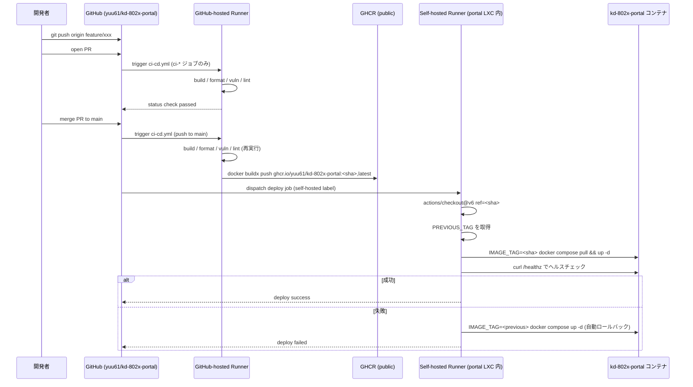

# kd-802x-portal CI/CD アーキテクチャ設計

## 1. 目的とスコープ

GitHub Actions を中心とした PoC スコープの CI/CD パイプラインを定義する。

**含む**:
- PR ごとの自動検証 (build / format / vulnerability scan / lint)
- main マージ後の自動デプロイ (GHCR への image push + Proxmox LXC への自動更新)
- Self-hosted runner (Proxmox 内 LXC) によるオンプレ環境とのブリッジ
- ヘルスチェック失敗時の自動ロールバック + 手動ロールバック

**含まない (本番検討事項)**:
- 環境分離 (dev / staging / prod)、カナリアリリース、Blue-Green
- Trivy / Snyk / SBOM 等のセキュリティスキャン
- Kubernetes / Helm への移行
- Runner と portal の LXC 分離

## 2. ブランチ戦略

GitHub Flow を採用:

```
main (常にデプロイ可能、保護ブランチ)
 ├─ feature/xxx (短命、PR 経由でマージ)
 └─ fix/xxx
```

### Branch protection (PoC: 1 名運用)

GitHub は **作成者自身による approve を許可しない** ため、レビュー必須化は 1 名運用と両立しない。PoC では次の運用にする:

- `Require pull request before merging`: **有効**
- `Require approvals`: **0** (将来メンバーが増えたら 1 に上げる)
- `Require status checks to pass before merging`: **有効** (CI ジョブを必須に)
- `Require linear history`: 任意 (推奨: 有効)
- `Allow force pushes` / `Allow deletions`: 無効
- 直接 push は禁止

main マージで自動デプロイが走る。

## 3. リポジトリ構成

```
.github/
└── workflows/
    ├── ci-cd.yml      # PR 検証 + main マージ後のデプロイを 1 ファイルに統合
    └── rollback.yml   # 手動 (workflow_dispatch) ロールバック
```

CI と CD を **1 つの workflow ファイルに統合** する。CI ジョブを CD ジョブの `needs:` に置くことで「CI 失敗中に CD が走る」レースを構造的に防ぐ。

## 4. 全体フロー



## 5. ワークフロー統合方針

`ci-cd.yml` 内で以下のジョブを定義:

```
ci-dotnet-build       ←┐
ci-dotnet-format       ├── 並列実行
ci-dotnet-vuln         │
ci-docker-build        │
ci-lint                ←┘
   │
   v (needs)
cd-build-and-push (GitHub-hosted、push to main 時のみ)
   │
   v (needs)
cd-deploy (self-hosted、push to main 時のみ)
```

- PR 時は `ci-*` ジョブのみ実行
- main push 時は `ci-*` → `cd-build-and-push` → `cd-deploy` の順
- `cd-*` ジョブには `if: github.event_name == 'push' && github.ref == 'refs/heads/main'` を付与

## 6. CI ジョブ群

### 6.1 トリガー (workflow 全体)

```yaml
on:
  pull_request:
    branches: [main]
  push:
    branches: [main]
```

### 6.2 ジョブ詳細

| ジョブ | 内容 | 実行環境 |
|---|---|---|
| `ci-dotnet-build` | `dotnet restore` + `dotnet build --no-restore -c Release` | ubuntu-latest |
| `ci-dotnet-format` | `dotnet format --verify-no-changes` | ubuntu-latest |
| `ci-dotnet-vuln` | `dotnet list package --vulnerable --include-transitive` | ubuntu-latest |
| `ci-docker-build` | `docker buildx build` (push なし、Dockerfile 検証 + cache 育成) | ubuntu-latest |
| `ci-lint` | shellcheck (`deploy/**/*.sh`) + yamllint (`docker-compose.yml`, `.github/workflows/*.yml`) + markdownlint (`docs/*.md`, `**/README.md`) | ubuntu-latest |

### 6.3 キャッシュ

- NuGet パッケージ: `actions/cache@v5` で `~/.nuget/packages`
- Docker buildx: `type=gha,mode=max`

## 7. CD ジョブ群

### 7.1 `cd-build-and-push` (GitHub-hosted)

1. `actions/checkout@v6`
2. `docker/login-action@v3` で GHCR にログイン (`GITHUB_TOKEN` を使用)
3. `docker/setup-buildx-action@v4`
4. `docker/build-push-action@v7`:
   - `context: .`
   - `file: deploy/Dockerfile`
   - `push: true`
   - `tags`:
     - `ghcr.io/yuu61/kd-802x-portal:${{ github.sha }}`
     - `ghcr.io/yuu61/kd-802x-portal:latest`
   - `cache-from: type=gha`
   - `cache-to: type=gha,mode=max`

### 7.2 `cd-deploy` (Self-hosted runner、`needs: cd-build-and-push`)

```yaml
cd-deploy:
  needs: cd-build-and-push
  if: github.event_name == 'push' && github.ref == 'refs/heads/main'
  runs-on: [self-hosted, linux, kd-802x-portal]
  environment:
    name: production
    url: https://<ポータル公開 URL>/
  steps:
    - uses: actions/checkout@v6
      with:
        ref: ${{ github.sha }}    # docker-compose.yml と IMAGE_TAG を同一 SHA で揃える

    - name: 直前バージョンを保存
      id: prev
      working-directory: deploy
      run: |
        PREV=$(docker compose images portal --format json 2>/dev/null \
                | jq -r '.[0].Tag // empty' || true)
        echo "tag=${PREV:-latest}" >> "$GITHUB_OUTPUT"

    - name: デプロイ
      working-directory: deploy
      env:
        IMAGE_TAG: ${{ github.sha }}
      run: |
        docker compose pull portal
        docker compose up -d portal

    - name: ヘルスチェック
      id: health
      run: |
        for i in $(seq 1 30); do
          if curl -fsSL --max-time 5 http://localhost:8080/healthz; then
            exit 0
          fi
          sleep 2
        done
        echo "::error::healthz did not respond within 60s"
        exit 1

    - name: ロールバック (ヘルスチェック失敗時)
      if: failure() && steps.health.outcome == 'failure'
      working-directory: deploy
      env:
        IMAGE_TAG: ${{ steps.prev.outputs.tag }}
      run: |
        echo "::warning::Rolling back to ${IMAGE_TAG}"
        docker compose up -d portal
```

**前バージョンタグの取得タイミングが重要**: 必ず `docker compose pull && up -d` の **前** に取得すること。後で取ると現バージョン自身が返る。

### 7.3 タグ戦略

| タグ | 用途 |
|---|---|
| `<git-sha>` (40 文字) | 個別コミットの固定参照、ロールバック用 |
| `latest` | main の最新 (移動する) |
| `vX.Y.Z` | リリースタグ (将来) |

## 8. Self-hosted Runner

### 8.1 配置: portal LXC 同居 (PoC)

PoC では **portal LXC に同居**:

| 項目 | 値 |
|---|---|
| 配置 | portal LXC (10.98.38.5) と同一 LXC 内 |
| Runner ユーザ | `runner` (非 root、`docker` グループ所属) |
| ラベル | `self-hosted, linux, kd-802x-portal` |
| Docker socket | `/var/run/docker.sock` に group 経由でアクセス |
| Inbound | 不要 (GitHub への long-poll でジョブ取得) |
| Outbound | GitHub API (443) + GHCR (443) |

**同居のメリット**:
- SSH 経由のデプロイレイヤが消える (`docker compose` を runner が直接実行)
- LXC が 1 台で済む (リソース節約)
- 鍵運用 (SSH 鍵 / authorized_keys) が不要

**懸念とその扱い**:
- Runner 侵害 = portal 侵害 という直接性 — ただし SSH 経由でも結局 docker を実行する権限が必要なので等価
- 本番では別 LXC に分離 (§16 に記載)

### 8.2 セキュリティ前提

- **リポジトリは private** 想定 (`yuu61/kd-802x-portal`)
- もし public にする場合は、fork PR で self-hosted runner が起動しないようジョブに条件を付ける:

  ```yaml
  if: github.event.pull_request.head.repo.full_name == github.repository
  ```

- runner のラベルを `kd-802x-portal` で限定し、他リポジトリからの誤利用を防ぐ

### 8.3 セットアップ手順 (概要)

```bash
# portal LXC 内で
sudo useradd -m -s /bin/bash runner
sudo usermod -aG docker runner
sudo -iu runner

mkdir -p ~/actions-runner && cd ~/actions-runner
curl -O -L https://github.com/actions/runner/releases/download/v<latest>/actions-runner-linux-x64-<ver>.tar.gz
tar xzf actions-runner-linux-x64-<ver>.tar.gz
./config.sh --url https://github.com/yuu61/kd-802x-portal \
            --token <RUNNER_TOKEN> \
            --labels kd-802x-portal \
            --unattended
sudo ./svc.sh install runner
sudo ./svc.sh start

# portal の compose 配置を runner からも読めるように調整
sudo chown -R runner:runner /opt/kd-802x-portal
```

## 9. シークレット管理

### 9.1 GitHub Secrets

| Secret | 用途 | 備考 |
|---|---|---|
| `GITHUB_TOKEN` | GHCR への image push、Deployments API | 自動付与、明示設定不要 |

SSH 経由のデプロイを廃止した (8.1 同居方式) ため、`PORTAL_SSH_*` シークレットは不要。

### 9.2 GHCR からの pull 認証

3 案を検討:

| 案 | 内容 | 採用 |
|---|---|---|
| **(a) パッケージ visibility を public** | GHCR の package settings で `Public` に変更、`docker pull` に認証不要 | **○ (PoC)** |
| (b) PAT (`read:packages`) を runner に保管 | `~/.docker/config.json` に `auth=base64(user:pat)` | △ (PAT 管理が増える) |
| (c) GitHub App Installation Token | デプロイジョブで `actions/create-github-app-token` → `docker login` | × (PoC では重い) |

**PoC では (a) public を採用**。理由:
- ポータルの image 自体は公開しても機密ではない (シークレットは image に焼かず環境変数注入のみ)
- runner 側の認証セットアップが不要

### 9.3 image にシークレットを焼かない原則

`Dockerfile` でビルド時に環境変数を埋め込まない。`appsettings.json` にも実値を入れず、placeholder のみ。実値は `.env` / Docker secret / 起動時環境変数のみで注入する。

### 9.4 LXC ローカルのシークレット

- `/opt/kd-802x-portal/deploy/.env` (chmod 600、runner ユーザ所有)
- 内容: `DB_PASSWORD`, `GOOGLE_CLIENT_*`, `RADIUS_SHARED_SECRET`, `WLC_SHARED_SECRET`, `VAULT_ROLE_ID`, `VAULT_SECRET_ID`
- GitHub には保存しない (`.gitignore` で除外済み)

## 10. ロールバック

### 10.1 自動ロールバック (CD `cd-deploy` ジョブ内)

§7.2 の YAML の通り。ポイント:
1. デプロイ **前** に `PREVIOUS_TAG` をローカル変数に取得 (`docker compose images` で現在動作中のタグを取り出す)
2. デプロイ後の `/healthz` 失敗時、`if: failure()` ステップで `IMAGE_TAG=${PREVIOUS_TAG}` で `docker compose up -d portal`
3. workflow ステータスは失敗のままにして通知

### 10.2 手動ロールバック (`.github/workflows/rollback.yml`)

```yaml
on:
  workflow_dispatch:
    inputs:
      target_sha:
        description: 'ロールバック先の git SHA (40文字)'
        required: true

jobs:
  rollback:
    runs-on: [self-hosted, linux, kd-802x-portal]
    environment:
      name: production
    steps:
      - uses: actions/checkout@v6
        with:
          ref: ${{ inputs.target_sha }}
      - name: ロールバック
        working-directory: deploy
        env:
          IMAGE_TAG: ${{ inputs.target_sha }}
        run: |
          docker compose pull portal
          docker compose up -d portal
```

GHCR に対象 SHA のタグが残っていることが前提 (image は明示削除しない限り保持される)。

## 11. `docker-compose.yml` の改修 (Phase 1.5 で実施)

CD で GHCR の image を pull できるよう、`portal` サービスを以下に改修する:

```yaml
services:
  portal:
    image: ghcr.io/yuu61/kd-802x-portal:${IMAGE_TAG:-latest}
    # build セクションは CI のローカルビルド・開発時の `docker compose build` で使用
    build:
      context: ..
      dockerfile: deploy/Dockerfile
    ...
```

**重要**: この改修は **Phase 2 (GHCR push) の前提条件**。先に Phase 1.5 を完了させないと、CD ジョブで pull できる image がなくデプロイが全滅する。

## 12. ヘルスチェックエンドポイント

**PoC は liveness のみ** (200 OK 即返却):

```csharp
app.MapGet("/healthz", () => Results.Ok(new { status = "ok" }))
   .AllowAnonymous();
```

Vault / DB 接続確認を含めるかは本番検討事項 (含めると Vault sealed 中・DB 起動中に readiness で詰まる懸念がある)。Phase 1.5 で Program.cs に追加。

`Dockerfile` 末尾に `HEALTHCHECK` も追加すると Docker レベルでも検知できる:

```dockerfile
HEALTHCHECK --interval=30s --timeout=5s --start-period=20s --retries=3 \
  CMD curl -fsSL http://localhost:8080/healthz || exit 1
```

## 13. GitHub Environments

CD ジョブに `environment: production` を付与:
- Deployments タブでデプロイ履歴が可視化
- 環境固有 secrets を後付け可能
- 将来 manual approval rule を追加可能 (PoC では未使用)

```yaml
cd-deploy:
  environment:
    name: production
    url: https://<ポータル公開 URL>/
```

## 14. 監視と通知

| 項目 | 方法 |
|---|---|
| CI/CD のステータス | README にバッジ (``) |
| 失敗通知 | GitHub の組込みメール通知。将来: Discord/Slack Webhook 連携 |
| デプロイ履歴 | GitHub Actions Deployments タブ |
| ランタイム監視 | LXC server (10.98.38.3) の Prometheus + Grafana (構成図参照) |

## 15. 段階的導入計画

| Phase | 内容 | 前提 / 完了条件 |
|---|---|---|
| 0 | リポジトリを GitHub `yuu61/kd-802x-portal` に push、**private** で作成 | git remote add + push |
| 1 | `.github/workflows/ci-cd.yml` の **ci-* ジョブ** を有効化 | PR が CI で検証される |
| **1.5** | **`docker-compose.yml` を image ベースに改修 + Program.cs に `/healthz` 追加 + Dockerfile に HEALTHCHECK** | Phase 2 開始の前提 |
| 2 | `cd-build-and-push` ジョブを有効化、GHCR にイメージ push + パッケージ visibility を **public** に設定 | main push で image が GHCR に上がる |
| 3 | Self-hosted runner を **portal LXC 内** に立てる (同居方式) | runner が GitHub に認識される、ラベル `kd-802x-portal` |
| 4 | `cd-deploy` ジョブを有効化 (自動ロールバック含む)、GitHub Environments を `production` で作成 | main push で自動デプロイ + ヘルスチェック |
| 5 | (将来) Discord 通知、Trivy スキャン、SBOM、本番分離 | - |

## 16. PoC スコープ外 (本番検討事項)

| 領域 | 本番で評価する論点 |
|---|---|
| 環境分離 | dev / staging / prod の 3 環境化、各 LXC を別に |
| Runner 分離 | portal と runner を別 LXC に分離、SSH またはエージェントレスデプロイ |
| デプロイ戦略 | カナリア / Blue-Green / ローリング |
| セキュリティ | Trivy / Grype による image スキャン、SBOM 生成、Dependabot、container signing (Cosign) |
| シークレット | SOPS-age / HashiCorp Vault との連携で `.env` の暗号化保管、GitHub Secrets の dynamic rotation |
| マイグレーション | `dotnet ef migrations bundle` を CI で生成し、デプロイ前に `bundle apply` |
| 観測 | OpenTelemetry / Grafana Loki への構造化ログ転送、デプロイメトリクス可視化 |
| Runner | エフェメラル runner (ARC: Actions Runner Controller on Kubernetes) |
| ロールバック | メトリクス連動の自動ロールバック (Argo Rollouts 等) |
| ヘルスチェック | readiness (Vault + DB 接続確認) と liveness の分離 |
